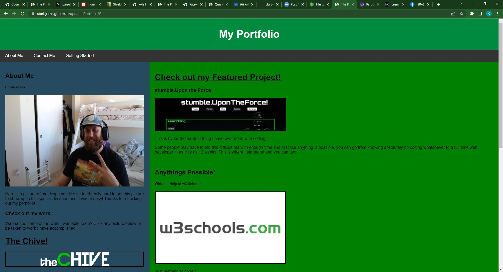

# UPDATED PORTFOLIO

Welcome to my Portfolio webpage. This is where you are going to learn about who I am and the journey I am on (and took depending on when you are reading this).

## Description

This website is a professional website page for myself Kyle Henriksen. I am learning how to code at the Denver University and part of the bootcamp is to build a Portfolio Webpage for yourself so that I may use this opportunity to show off my skill to the public when I complete the course.

## Purpose

The purpose is to obtain a skill set that I can use as a professional tool, also as a personal hobby to better understand the internet and how it works.

## User

You will see all my different work layouts, from "TheChive" (not my actual work) to "The quiz." (actual work I attempted.) You will find my resume` and a way to communicate to me through different social media outlets. Nothing personal about me as of yet on this website just my recent accomplishments.

## Results

So far I am learning alot from the bootcamp and cant wait to put my new found skills to the test. I need to focus more on my professional career benchmarks that the school provides me so I can find a job in this line of work.

